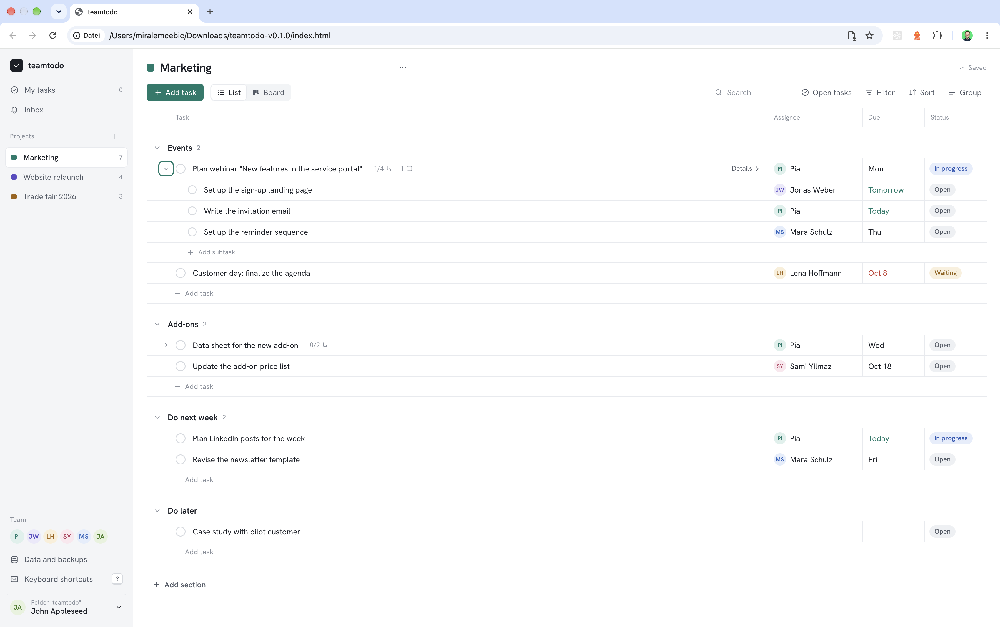

# teamtodo

[](https://github.com/miralem-cebic/teamtodo/actions/workflows/ci.yml)
[](https://github.com/miralem-cebic/teamtodo/releases)
[](LICENSE)
[](CONTRIBUTING.md)

**teamtodo** is a task management tool for marketing teams.

It runs entirely in the browser and does not need a server. All data is stored as plain files in a shared folder, for example on OneDrive or SharePoint, so your team keeps full control over its data.

<!-- TODO: add a screenshot at docs/screenshot.png and uncomment the line below -->
<!--  -->

## Highlights

- **Task management for marketing teams**: keep track of who is working on what.
- **No server required**: the app runs in the browser, there is no backend to host or maintain.
- **Your data, your storage**: data lives as files in a shared folder (OneDrive, SharePoint, or any synced folder).

## Getting started

### Use a release

1. Go to the [Releases](https://github.com/miralem-cebic/teamtodo/releases) page.
2. Download the latest `teamtodo-<version>.zip` and verify it with the attached `.sha256` file.
3. Extract the archive and open the app in your browser.

### Build from source

```bash
git clone https://github.com/miralem-cebic/teamtodo.git
cd teamtodo
```

Build and test steps are defined in [`.github/workflows/build.yml`](.github/workflows/build.yml) and run automatically on every pull request.

## Documentation

- [Contributing guide](CONTRIBUTING.md): how to propose changes, coding conventions, and the pull request workflow.
- [Code of Conduct](CODE_OF_CONDUCT.md): how we expect everyone to behave.
- [Security policy](SECURITY.md): how to report vulnerabilities responsibly.
- [Changelog](CHANGELOG.md): what changed in each release.

## Contributing

Contributions are welcome, whether it is a bug report, a feature idea, documentation, or code.

- Look at [open issues](https://github.com/miralem-cebic/teamtodo/issues) and pick one labeled `good first issue` or `help wanted`.
- Open an issue before starting larger changes so we can agree on the approach.
- Submit your changes as a pull request. Every change goes through a pull request and CI before it lands on `main`.

Please read the [contributing guide](CONTRIBUTING.md) first.

## Community

- Report a bug or request a feature with the [issue templates](https://github.com/miralem-cebic/teamtodo/issues/new/choose).
- Report a security issue privately, see [SECURITY.md](SECURITY.md).

## License

Distributed under the MIT License. See [LICENSE](LICENSE) for more information.
