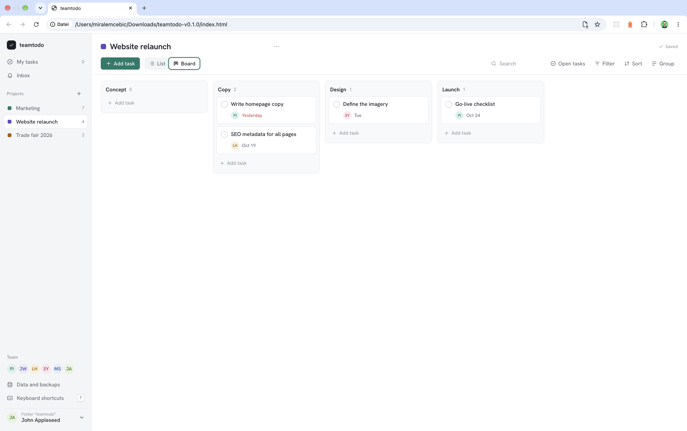

# teamtodo User Guide

teamtodo is a task management tool for marketing teams. It runs directly in the browser, needs no server and no internet connection. All data is stored as files in a shared folder, for example on OneDrive.

## Opening the app

1. Open the folder with the app. It contains `index.html` and the `assets` folder.
2. Double-click **`index.html`**.
3. The app opens in your default browser. It only works in **Google Chrome** and **Microsoft Edge**. If another browser is your default, right-click `index.html` → "Open with" → Chrome or Edge.

Tip: bookmark the opened page to get there faster next time.

## Language

The app is available in **English**, **Deutsch**, **Français**, **Español** and **Italiano**. It starts in the language of your browser (English if it is not one of these). To change it, click your name at the bottom left, then choose a language under **Language**. The choice is saved in this browser only.

## Theme

For a softer look, choose a pastel theme in the same menu, under **Theme**: **Light blue**, **Light green**, **Pink**, **Lavender** or **Peach**. **Standard** is the default. Dark mode follows your computer's setting. The choice is saved in this browser only.

## Notifications

Your browser can show a notice when a teammate **assigns you a task**, or when one of your tasks is **due today**. For a task with a time, the notice comes up to an hour before that time. Turn this on in the account menu at the bottom left, under **Notifications**. The browser asks for permission the first time. The setting applies to this browser only.

Notifications appear while teamtodo is open in a tab or window. Clicking a notice opens the task. If the browser blocks notifications, allow them for the site in the browser's settings.

## Connecting the data folder

On first start, the app asks for the **data folder**. This is the folder where your team's tasks are stored.

- Everyone in the team selects the **same** folder, for example a shared OneDrive folder named "teamtodo".
- If the folder is empty, the app creates its files. You can optionally start with sample data.
- If the folder already contains other files, the app suggests creating a subfolder named "teamtodo" instead.

On later starts the app shows **"Continue with folder …"**. One click is enough. For security reasons the browser asks once per session whether the app may access the folder. Confirm with **Allow**.

**Important with OneDrive:** In Finder or Explorer, right-click the data folder and choose **"Always keep on this device"** (the menu name depends on the language of your OneDrive). Otherwise OneDrive first has to download the files and the app starts more slowly.

## Setting up your team

- On first start, choose **who you are**. If your name is missing, add yourself directly.
- This choice only applies to your browser. You can change it at the bottom left: click your name → **Switch person**.
- Further people are created automatically: type a new name in the person field and choose **Add "…" to the team**.

## Working with tasks

- **Create a task:** type the title, press **Enter**, then type the next task. No form, no save button.
- **Person and date:** click the field in the row, or press **Alt + P** (person) and **Alt + D** (date). In the date field you can type `today`, `tomorrow`, `fr`, `next week`, `+3` or `12.10.`. The German words (`heute`, `morgen`, `nächste woche`, `montag`, …) still work too.
- **Complete:** click the circle in front of the title, or press **Ctrl + Enter** (Mac: ⌘ + Enter).
- **Details:** click the row, or press **Ctrl + O**. A panel opens on the right with description and subtasks. The list stays visible.
- **Subtasks:** in the detail panel under **Subtasks**, or with **Alt + S** in the row. Each subtask has its own person and date.
- **Sections:** inside a project, sections group tasks. Add one with **Add section** below the last section. Rename it by double-clicking the name.
- **My tasks** shows everything assigned to you, across all projects, sorted by due date.


### Moving tasks with drag and drop

When you hover over a row, a handle (⋮⋮) appears on its left edge. Drag it to move a task within a section or into another section. Sections are moved by the handle next to their name; subtasks work the same way in the detail panel. Dragging a task onto **Today** in **My tasks** sets its date to today. Nothing can be dropped onto **Overdue**.

### Board, filter, sort, group

- **List, board, or calendar:** switch at the top, or press **L** / **B** / **C**. On the board, the columns follow the current grouping (by default the sections of a project). Drag cards to another column.
- **Filter** by responsible person, due date, and status. Active filters are highlighted, and the small × resets them.
- **Sort** by due date, title, person, or creation date. Ordering by dragging is only available with **Manual**.
- **Group** by section, person, due date, status, or project.
- **Open tasks / All tasks / Completed tasks** shows or hides completed tasks.



### Calendar

The calendar shows the open tasks of the current view by their due date. Weeks start on Monday.

- Use **‹** and **›** to change the month, and **Today** to return to the current month. Overdue tasks are shown in red.
- Click a task to open it, or tick its box to complete it. A **+** on a day creates a task due on that day; with the keyboard, select a day and press Enter.
- **Without due date** lists the open tasks that have no date yet, so nothing gets lost.
- The project header shows **Last due**: the latest due date of the project's open tasks.
- Arrow keys move between days. On a phone, each day shows a dot per task.

### Calendar export

Tasks can be taken into Outlook, Apple Calendar, or Google Calendar as a calendar file (`.ics`):

- **One task:** open it, choose **⋯** → **Export to calendar (.ics)**.
- **All open tasks of the view:** click **Calendar export** in the toolbar. Tasks without a due date are skipped, and the message says how many.

Open the downloaded file, or attach it to an email. A task without a time becomes an all-day event; a task with a time becomes a 30-minute event at that time. Importing the file again updates the same events instead of creating copies. The export is a snapshot: a later change of the due date does not reach the calendar until you export again.

### Comments, attachments, followers

- **Comments** are written at the bottom of the detail panel. Type **@** and the first letters of a name to mention someone. Send with **Ctrl + Enter** (Mac: ⌘ + Enter).
- **Attachments:** use **Attach a file**, or drag files into the **Attachments** area. The file is copied into the data folder (`attachments`). Click it to open.
- **Followers** are notified about comments on a task. Whoever creates a task, is assigned to it, comments on it, or is mentioned in it follows it automatically.
- **History:** **Comments and activity** shows who changed what and when. **Show comments only** hides the changes.
- **Arrows** at the top of the detail panel go to the previous and next task in the list, in the order shown.

### Links

- A web address in a description or comment becomes a link by itself, for example `https://example.com/page`. Click it to open it in a new tab. Click elsewhere in a description to edit it.
- To link a word, select it and press **Ctrl + K** (Mac: ⌘ + K). Enter the address, for example `example.com/page`, and press **Enter**. Without a selection, the address itself becomes the link.
- Only `http` and `https` addresses are accepted.

## Templates

A template keeps the structure of a project: its sections, tasks, descriptions and subtasks. Assignments, due dates, status and comments are not kept.

- **Save a project as a template:** open the project menu (⋯ next to the project name) and choose **Save as template**. Templates are listed under **Templates** in the navigation.
- **New project from a template:** press **+** next to **Projects** and choose **Start from** a template, or use **New project** under **Templates**. Tasks are copied without assignments and due dates, so the project starts clean.
- **Blank project:** choose **Blank project** in the same dialog.
- **Manage templates** under **Templates**: rename a template by editing its name, or delete it (with undo). Templates do not appear in the project list or in any task view.

### Inbox

The **Inbox** shows what others did for you: a task assigned to you, a mention, a comment or completion on a task you follow. Unread items are marked with a dot, and the count appears in the navigation. Press **G**, then **I** to jump there.

### Teamwork

The app syncs with the data folder every 10 seconds and whenever you return to the window. Changes by others appear without reloading, and the row briefly lights up. If two people edit the same task at the same time, the app merges the changes field by field: if one person changes the title and another changes the date, both changes are kept. Only when both change the same field does the later change win. Comments are never lost.

### Undo instead of confirmation prompts

Completing, deleting, moving, and reassigning happen immediately. A notice with **Undo** appears at the bottom. Alternatively, press **Ctrl + Z** (Mac: ⌘ + Z) while no input field is active.

### Saving

The app saves every change automatically. The status at the top right shows **Saving …** or **Saved**. If a red message appears there:

- **"No access to the folder."** → click **Reconnect** and allow access.
- **"Data folder not found. Was it moved or renamed?"** → at the bottom left, choose **Choose another data folder**.

Until saving works again, the app keeps your changes. Do not close the window in the meantime.

## Keyboard shortcuts

Press **?** to show the full list in the app.

| Key                         | Action                                                                  |
| --------------------------- | ----------------------------------------------------------------------- |
| Enter                       | Save task, new row below                                                |
| Ctrl/⌘ + K                  | Make the selected text in a description or comment a link               |
| Ctrl/⌘ + Enter              | Complete / reopen                                                       |
| ↑ / ↓                       | Previous / next task                                                    |
| Ctrl/⌘ + Shift + ↑ / ↓      | Move task                                                               |
| Tab                         | Next field (person, date, status)                                       |
| Alt + P / Alt + M / Alt + D | Choose person / assign to me / choose date                              |
| Alt + S                     | Create subtask                                                          |
| Esc                         | Leave input. Then ↑/↓ selects rows, Space opens details, Delete removes |
| N                           | New task                                                                |
| /                           | Search                                                                  |
| G, then M                   | Go to **My tasks**                                                      |
| G, then I                   | Go to inbox                                                             |
| L / B / C                   | List / board / calendar                                                 |
| Ctrl/⌘ + Z                  | Undo                                                                    |
| ?                           | All shortcuts                                                           |

On a Mac, Alt is the ⌥ (Option) key.

## Backing up and restoring

All data is stored as files in the data folder:

```text
teamtodo/
  workspace.json   name and version
  users.json       team
  projects.json    projects and sections
  tasks/           one file per task
  attachments/     attachments, one folder per task
  backups/         daily backups
```

- **Automatic:** the first person to open the app on a given day creates a full backup in `backups`. The latest 14 are kept.
- **Restore:** open **Data and backups** from the navigation, then click **Restore …** on the backup you want. The current state is backed up first, so a wrong restore can be undone. Attachments are not part of the backups; they stay in the `attachments` folder.
- **Additionally:** copy the whole data folder as a ZIP now and then. OneDrive also keeps earlier versions of each file (right-click → version history).
- **Deleted tasks** stay as files at first and are only removed permanently after 30 days.

## Known limitations

- **Only Chrome and Edge.** Safari and Firefox cannot write directly into folders.
- **Confirm once per session.** The browser asks for folder access on every start.
- **OneDrive conflicts:** if two computers save the same file at the same moment, OneDrive sometimes creates a conflict copy (for example `…-LAPTOP-123.json`). The app ignores such copies and shows a notice at the bottom left. The file names are listed under **Data and backups**. They can be deleted in the data folder.
- **OneDrive delay:** the app only sees changes made by others once OneDrive has downloaded them to your computer. This usually takes seconds, sometimes longer.
- **Clock of the computer:** for simultaneous changes, the newer one wins. If a computer's clock is far off, the order can be wrong.
- **Read markers in the inbox** only apply to the browser where you set them.
- **Date input** understands English and German words (such as `tomorrow`, `morgen`, `fr`, `Freitag`). Dates in numeric form (`12.10.`) work in every language.
- **Sample data** is always in English.
- **Notifications** only appear while teamtodo is open.
- **Calendar export** is a one-time file. Calendars do not follow later changes in teamtodo; export again to update them.
- **Keyboard drag and drop:** instead of dragging, move with Ctrl/⌘ + Shift + ↑/↓. To move to another section, use the section field of the row.
